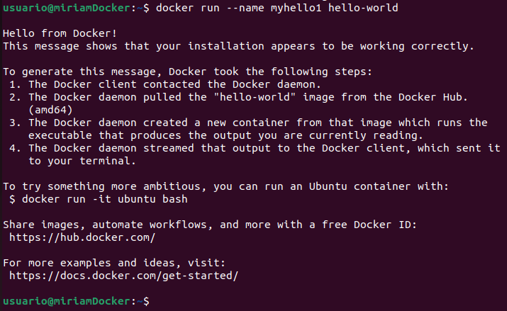

## Práctica 3

1. Descarga la imagen de ubuntu.

- Para enumerar las imágenes disponibles para Ubuntu, usamos el comando `docker search ubuntu`:

```bash
docker search ubuntu
```


- Para extraer la imagen oficial de Ubuntu, usamos el comando `docker pull ubuntu`:

```bash
docker pull ubuntu
```


2. Descarga la imagen de hello-world.

- Descargamos la imagen `hello-world` con el siguiente comando:

```bash
docker image pull hello-world
```


3. Descarga la imagen nginx.

- Para descargar la imagen de `nginx` ejecutamos:

```bash
docker image pull nginx
```


4. Muestra un listado de todas la imágenes.

- Para enumerar todas las imágenes de Docker actualmente en el servidor, usamos el comando `docker images`:

```bash
docker images
```


5. Ejecuta un contenedor `hello-world` y dale nombre “myhello1”.

- Sería de la siguiente manera:

```bash
docker run --name myhello1 hello-world
```



6. Ejecuta un contenedor `hello-world` y dale nombre “myhello2”.

- Volvemos a ejecutar el comando del ejercicio anterior pero cambiando el nombre:

```bash
docker run --name myhello2 hello-world
```


7. Ejecuta un contenedor `hello-world` y dale nombre “myhello3”.

```bash
docker run --name myhello3 hello-world
```


8. Muestra los contenedores que se están ejecutando.

- Para mostrar los contenedores que se están ejecutando usamos el siguente comando:

```bash
docker ps -a
```


9. Para el contenedor "myhello1”.

- Paramos el contenedor ejecutando el siguiente comando:

```bash
docker container stop myhello1
```


10. Para el contenedor "myhello2”.

```bash
docker container stop myhello2
```


11. Borra el contenedor “myhello1”.

- Borramos el contenedor de la siguiente manera:

```bash
docker container rm -f myhello1
```


12. Muestra los contenedores que se están ejecutando.

- Volvemos a mostrar los contenedores que se están ejecutando:

```bash
docker ps -a
```


13. Borra todos los contenedores.

- Borramos el contenedor `myhello2` y `myhello3`:

```bash
docker container rm -f myhello2
```

```bash
docker container rm -f myhello3
```


- Y, por último, si listamos los contenedores que están en ejecución, vemos que no nos aparece ninguno:

```bash
docker ps -a
```


> He estado buscando información de porqué si ejecuto `docker ps -a` me aparecen los contenedores parados y es porque la opción `-a` muestra todos los contenedores, independientemente de si están en ejecución o detenidos. El estado de `Exited`, significa que se inició y luego se detuvo inmediatamente después.
> También he encontrado el porqué si ejecuto `doker ps` no muestra nada, y es porque un contenedor ejecuta un proceso y cuando termina la ejecución, el contenedor se para:


[Volver a la página principal](../README.md)
