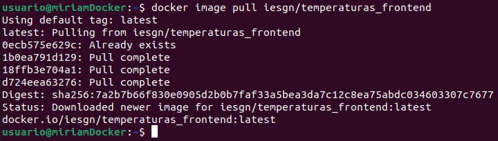

# Práctica 4

## Ejemplo 1: Despliegue de la aplicación Guestbook

En este ejemplo vamos a desplegar una aplicación web que requiere de dos servicios (servicio web y servicio de base de datos) para su ejecución. La aplicación se llama GuestBook y necesita los dos siguientes servicios:

* La aplicación guestbook es una aplicación web desarrollada en python que es servida por el puerto 5000/tcp. Utilizaremos la imagen `iesgn/guestbook`.

```bash
docker image pull iesgn/guestbook
```


* Esta aplicación guarda la información en una base de datos no relacional redis, que utiliza el puerto 6379/tcp para conectarnos. Usaremos la imagen `redis`.

```bash
docker image pull redis
```


- Después de instalar las imágenes, vamos a crear los dos contenedores en la misma red, para ello ejecutamos los siguiente:

```bash
docker network create red_guestbook
```


- Ahora ejecutamos el primer contenedor:

```bash
docker run -d --name redis --network red_guestbook -v /opt/redis:/data redis redis-server --appendonly yes
```


- y después, el segundo:

```bash
docker run -d -p 80:5000 --name guestbook --network red_guestbook iesgn/guestbook
```


- Por último, si nos vamos a nuestro navegador y escribimos `hhtp://localhost/`, podemos comprobar que se ha creado todo correctamente:


## Ejemplo 2: Despliegue de la aplicación Temperaturas

Vamos a hacer un despliegue completo de una aplicación llamada Temperaturas. Esta aplicación nos permite consultar la temperatura mínima y máxima de todos los municipios de España. Esta aplicación está formada por dos microservicios:

* `frontend`: Es una aplicación escrita en Python que nos ofrece una página web para hacer las búsquedas y visualizar los resultados. Este microservicio hará peticiones HTTP al segundo microservicio para obtener la información. Este microservicio ofrece el servicio en el puerto 3000/tcp. Usaremos la imagen `iesgn/temperaturas_frontend`.

```bash
docker image pull iesgn/temperaturas_frontend
```



* `backend`: Es el segundo microservicio que nos ofrece un servicio web de tipo API Restful. A esta API Web podemos hacerles consultas sobre los municipios y sobre las temperaturas. En este caso, se utiliza el puerto 5000/tcp para ofrecer el servicio. Usaremos la imagen `iesgn/temperaturas_backend`.

```bash
docker image pull iesgn/temperaturas_backend
```


- Ahora creamos una red para conectar los dos contenedores:

```bash
docker network create red_temperaturas
```


- Ejecutamos los contenedores:

```bash
docker run -d --name temperaturas-backend --network red_temperaturas iesgn/temperaturas_backend
```


```bash
docker run -d -p 80:3000 --name temperaturas-frontend --network red_temperaturas iesgn/temperaturas_frontend
```


- Y, por último, probamos en el navegador que funciona correctamente:


## Ejemplo 3: Despliegue de Wordpress + mariadb

Para la instalación de WordPress necesitamos dos contenedores: la base de datos (imagen `mariadb`) y el servidor web con la aplicación (imagen `wordpress`).

```bash
docker image pull mariadb
```


```bash
docker image pull wordpress
```


- Ahora, creamos una red para los contenedores:

```bash
docker network create red_wp
```


- Ejecutamos el primer contenedor:

```bash
docker run -d --name servidor_mysql \
                --network red_wp \
                -v /opt/mysql_wp:/var/lib/mysql \
                -e MYSQL_DATABASE=bd_wp \
                -e MYSQL_USER=user_wp \
                -e MYSQL_PASSWORD=asdasd \
                -e MYSQL_ROOT_PASSWORD=asdasd \
                mariadb
```


- Y el segundo:

```bash
docker run -d --name servidor_wp \
                --network red_wp \
                -v /opt/wordpress:/var/www/html/wp-content \
                -e WORDPRESS_DB_HOST=servidor_mysql \
                -e WORDPRESS_DB_USER=user_wp \
                -e WORDPRESS_DB_PASSWORD=asdasd \
                -e WORDPRESS_DB_NAME=bd_wp \
                -p 80:80 \
                wordpress
```


- Nos vamos al navegador y comprobamos que funciona:


