# Práctica 5

## Ejemplo 1: Despliegue de la aplicación guestbook

En este ejemplo vamos a desplegar con docker-compose la aplicación *guestbook*.

- Lo primero que debemos hacer es crear el fichero `docker-compose.yml` e inlcuir lo siguiente:

```yml
version: '3.1'
services:
  app:
    container_name: guestbook
    image: iesgn/guestbook
    restart: always
    ports:
      - 80:5000
  db:
    container_name: redis
    image: redis
    restart: always
```

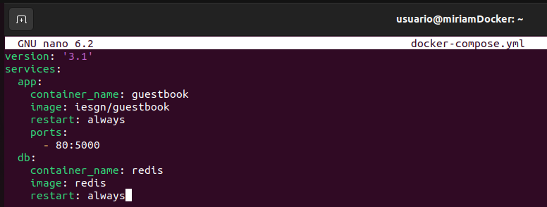

-----------------------------

- Antes de crear el escenario, debemos instalar `docker-compose`:

```bash
sudo apt install docker-compose
```

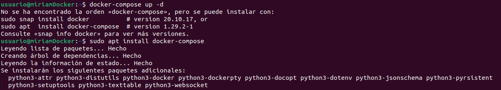

------------------------------

-Ahora si, podemos crear el escenario:

```bash
docker-compose up -d
```

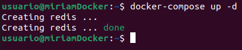

----------------------------

- Listamos los contendores:

```bash
docker-compose ps
```

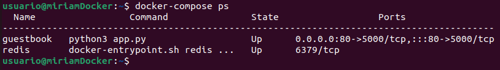

-------------------------------

- Comprobamos que funciona desde el navegador:

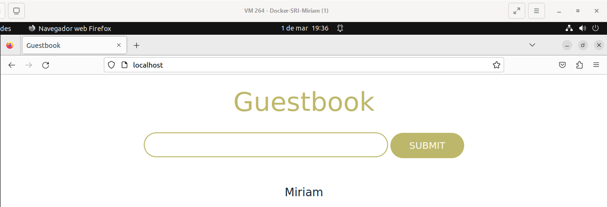

-------------------------------

- Paramos los contenedores:

```bash
docker-compose stop 
```

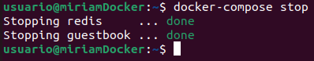

--------------------------

- Y, por último, eliminamos el escenario:

```bash
docker-compose down
```

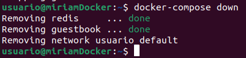

-------------------------------
--------------------------------

## Ejemplo 2: Despliegue de la aplicación Temperaturas

En este ejemplo vamos a desplegar con docker-compose la aplicación *Temperaturas*.

- Editamos el fichero anterior `docker-compose.yml` e incluimos lo siguiente:

```yml
version: '3.1'
services:
  frontend:
    container_name: temperaturas-frontend
    image: iesgn/temperaturas_frontend
    restart: always
    ports:
      - 80:3000
    depends_on:
      - backend
  backend:
    container_name: temperaturas-backend
    image: iesgn/temperaturas_backend
    restart: always
```

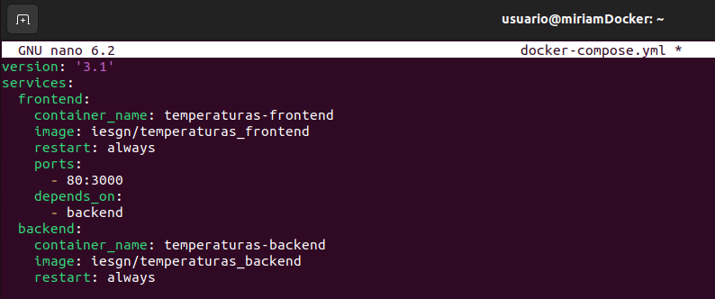

-------------------------------

- Creamos el escenario:

```bash
docker-compose up -d
```

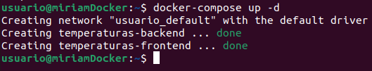

---------------------------------

- Listamos los contenedores:

```bash
docker-compose ps
```

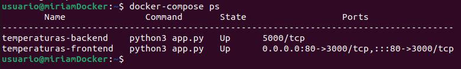

-------------------------------

- Y, por último, lo probamos en el navegador:

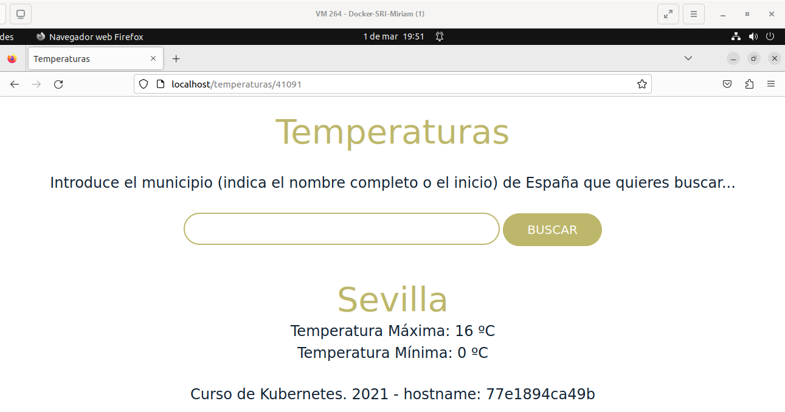

-----------------
----------------

## Ejemplo 3: Despliegue de WordPress + Mariadb

En este ejemplo vamos a desplegar con `docker-compose` la aplicación `WordPress + MariaDB`.

- Volvemos a editar el fichero `docker-compose.yml` incluyendo lo siguiente:

```yml
version: '3.1'
services:
  wordpress:
    container_name: servidor_wp
    image: wordpress
    restart: always
    environment:
      WORDPRESS_DB_HOST: db
      WORDPRESS_DB_USER: user_wp
      WORDPRESS_DB_PASSWORD: asdasd
      WORDPRESS_DB_NAME: bd_wp
    ports:
      - 80:80
    volumes:
      - wordpress_data:/var/www/html/wp-content
  db:
    container_name: servidor_mysql
    image: mariadb
    restart: always
    environment:
      MYSQL_DATABASE: bd_wp
      MYSQL_USER: user_wp
      MYSQL_PASSWORD: asdasd
      MYSQL_ROOT_PASSWORD: asdasd
    volumes:
      - mariadb_data:/var/lib/mysql
volumes:
    wordpress_data:
    mariadb_data:
```

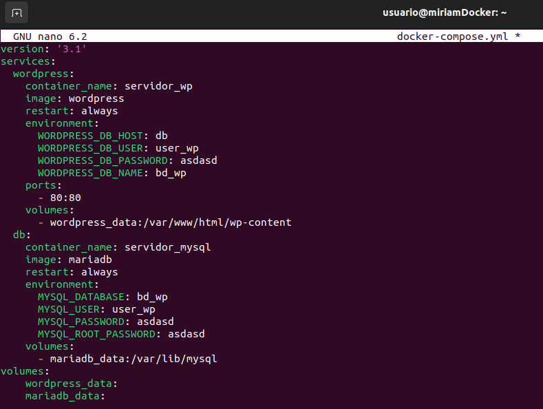

------------------------

- Creamos el escenario:

```bash
docker-compose up -d
```

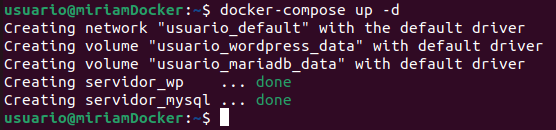

-------------------------

- Listamos los contenedores:

```bash
docker-compose ps
```

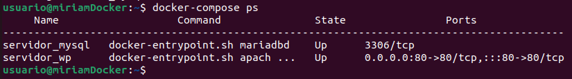

-----------------------------

- Y comprobamos si funciona en el navegador:

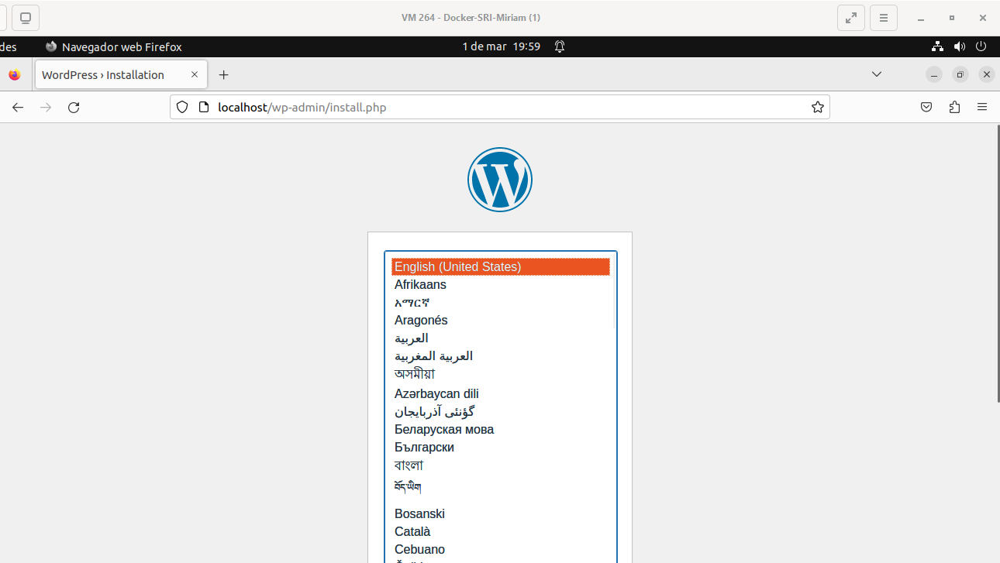

---------------------

- Paramos los contenedores:

```bash
docker-compose stop
```

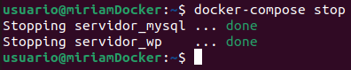

------------------------------

- Y borramos el escenario:

```bash
docker-compose down
```

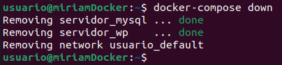

--------------------


- [Volver a la página principal](../README.md)
- [Práctica 4](../ejercicio4/ejercicio4.md)
- [Práctica 6](../ejercicio6/ejercicio6.md)
