# Ejercicio 6

## Ejemplo 1: Construcción de imágenes con una página estática

En este ejemplo vamos a crear una imágen con una página estática.

- Primero vamos a crear un directorio que se llame `Docker` y dentro creamos un fichero llamado `Dockerfile` y un directorio llamado `public_html` con un `index.html`:

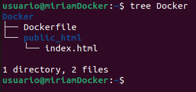

--------------------

- El fichero `Dockerfile` contendrá lo siguiente:

```Dockerfile
FROM debian
RUN apt-get update && apt-get install -y apache2 && apt-get clean && rm -rf /var/lib/apt/lists/*
ADD public_html /var/www/html/
EXPOSE 80
CMD ["/usr/sbin/apache2ctl", "-D", "FOREGROUND"]
```

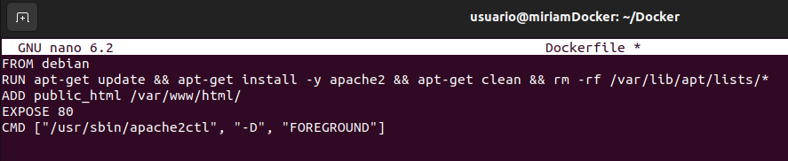

--------------------

- Para crear la imagen, nos movemos a la carpeta donde se encuentra el fichero `Dockerfile` y ejecutamos lo siguiente:

```bash
docker build -t miriam/ejemplo1:v1 .
```

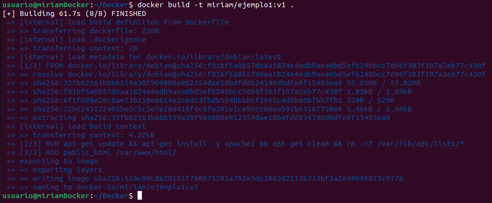

--------------------

- Comprobamos que la imagen se ha creado:

```bash
docker images
```

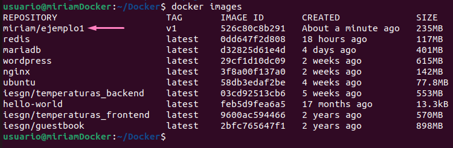

--------------------

- Creamos el contenedor:

```bash
docker run -d -p 80:80 --name ejemplo1 miriam/ejemplo1:v1
```

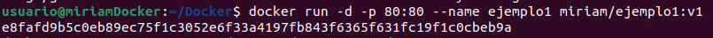

--------------------

- Y nos vamos al navegador para comprobar que funciona:

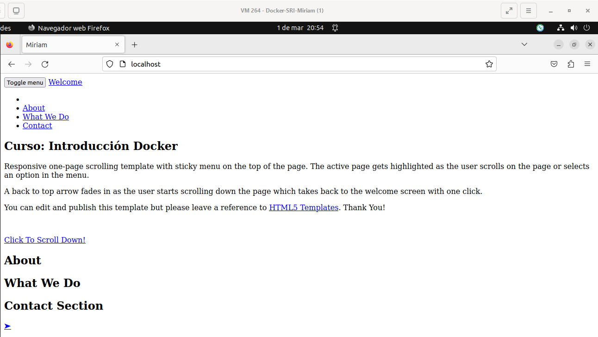

--------------------
--------------------

## Ejemplo 2: Construcción de imágenes con una una aplicación PHP

En este ejemplo vamos a crear una imágen con una página desarrollada con `PHP`.

- Primero, editamos el archivo `Dockerfile` e incluimos lo siguiente:

```Dockerfile
FROM debian
RUN apt-get update && apt-get install -y apache2 libapache2-mod-php7.4 php7.4 && apt-get clean && rm -rf /var/lib/apt/lists/*
ADD app /var/www/html/
RUN rm /var/www/html/index.html
EXPOSE 80
CMD ["/usr/sbin/apache2ctl", "-D", "FOREGROUND"]
```

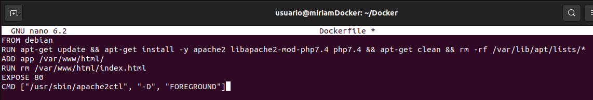

--------------------

- Para crear la imagen, nos movemos a la carpeta donde se encuentra el fichero `Dockerfile` y ejecutamos lo siguiente:

```bash
docker build -t miriam/ejemplo2:v1 .
```

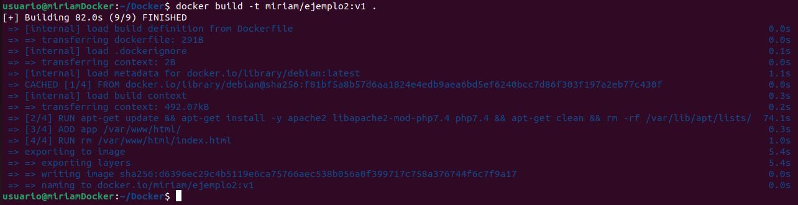

--------------------

- Comprobamos que la imagen se ha creado:

```bash
docker images
```

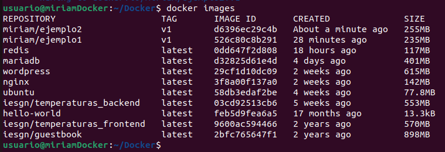

--------------------

- Creamos el contenedor:

```bash
docker run -d -p 80:80 --name ejemplo2 miriam/ejemplo2:v1
```

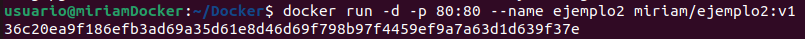

--------------------

- Y, por último, comprobamos en el navegador que funciona:

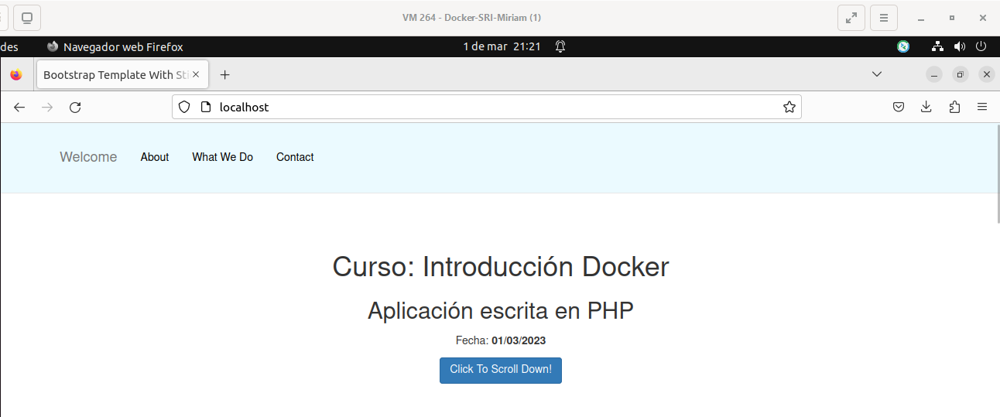

--------------------
--------------------

## Ejemplo 3: Construcción de imágenes con una una aplicación Python

En este ejemplo vamos a construir una imagen para servir una aplicación escrita en `Python` utilizando el framework `flask`.

- Editamos el archivo `Dockerfile` e incluimos lo siguiente:

```dockerfile
FROM debian

RUN apt-get update && apt-get install -y python3-pip  && apt-get clean && rm -rf /var/lib/apt/lists/*

COPY app /usr/share/app

WORKDIR /usr/share/app

RUN pip3 install --no-cache-dir -r requirements.txt

EXPOSE 3000

CMD [ "python3", "app.py"]
```

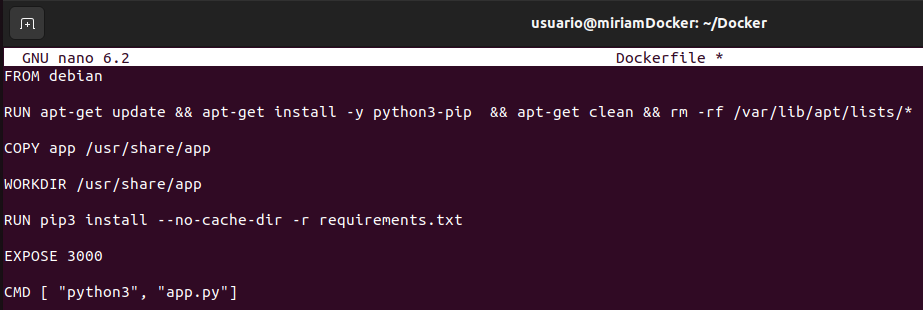

--------------------

- Para crear la imagen ejecutamos:

```bash
docker build -t miriam/ejemplo3:v1 .
```

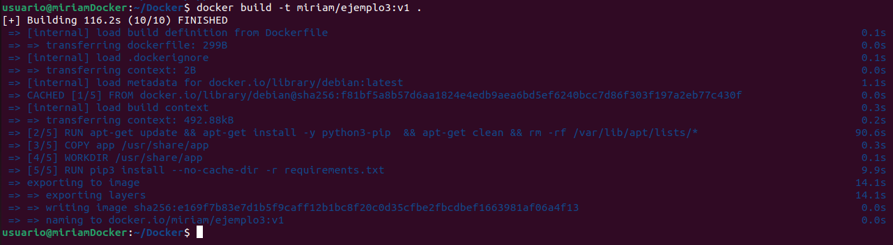

--------------------

- Comprobamos que la imagen se ha creado:

```bash
docker images
```

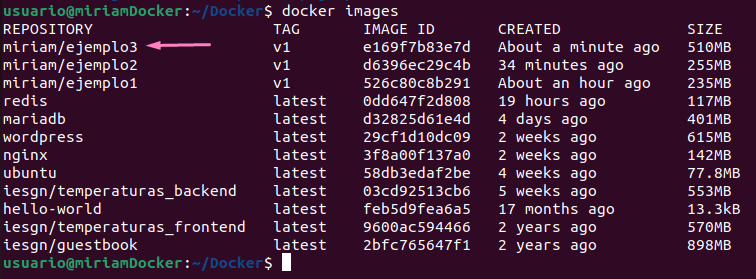

--------------------

- Creamos el contenedor:

```bash
docker run -d -p 80:3000 --name ejemplo2 miriam/ejemplo3:v1
```

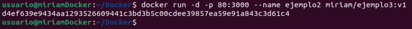

--------------------

- Y, para finalizar, comprobamos que funciona en el navegador:

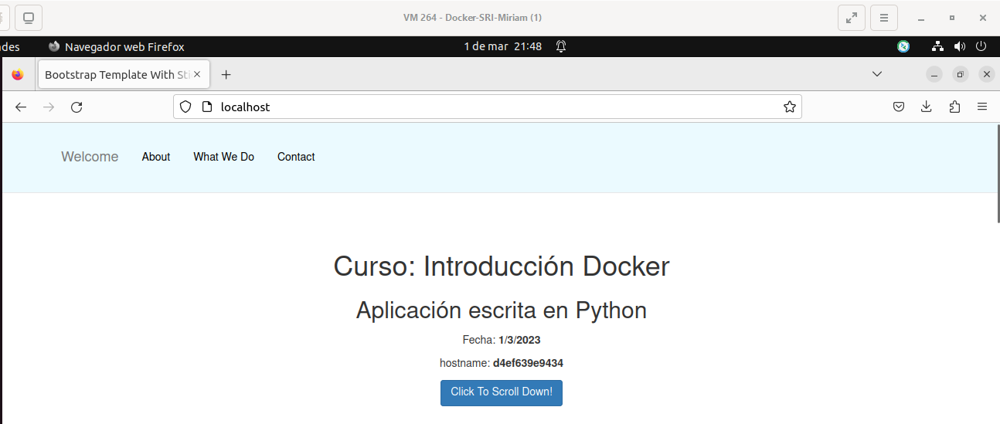

--------------------

<div style="text-align: center">[Volver a la página principal](../README.md)<div/>
